#  Procedural Solar System

A tool created for the generation and simulation of a solar system. Compute and pixel shaders generate the terrain, oceans and atmospheres of planets, moons and stars. Orbital calculations accurately simulate the forces being applied to all celestial bodies using Newtons law of universal gravitation. Atmospheres use raymarching to calculate Rayleigh and Mie scattering resulting in life like atmospheres. 

_Orbit video has no lighting and is sped up 4000%, its clear sun mass is not large enough_

_Nice atmosphere images - Rayleigh and Mie values change colour of the atmosphere and the suns glare_
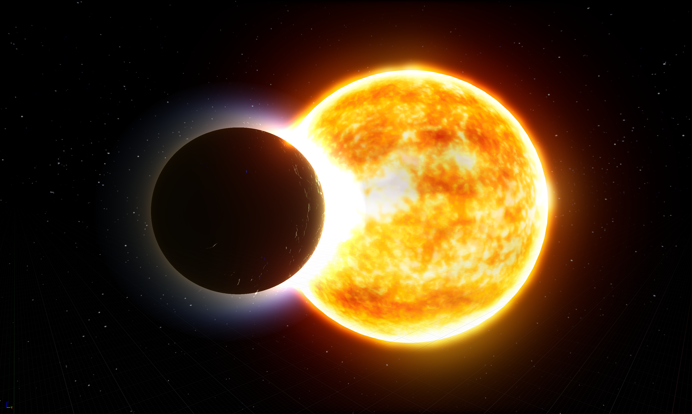 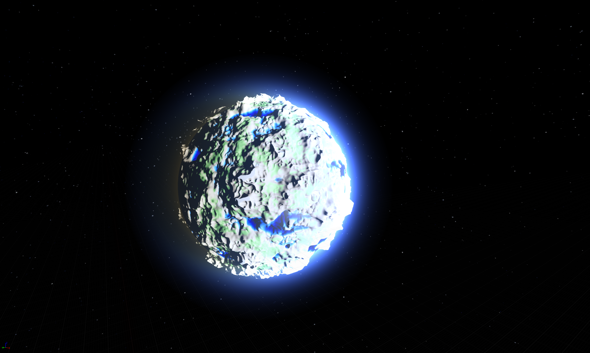 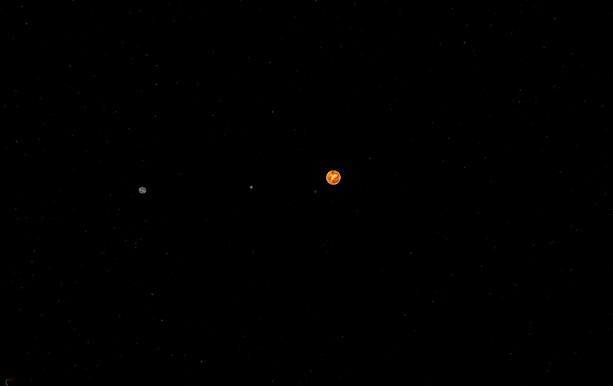 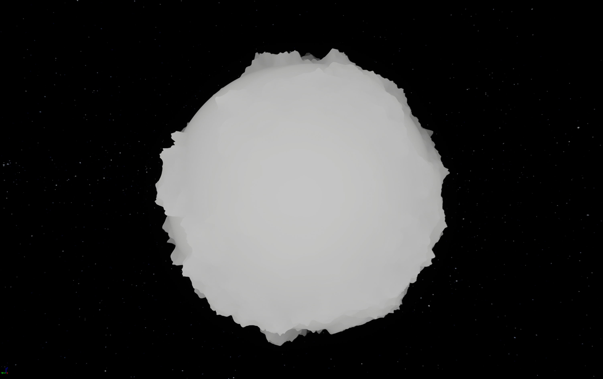

_Stable orbit can be achieved using the debug option to show path_
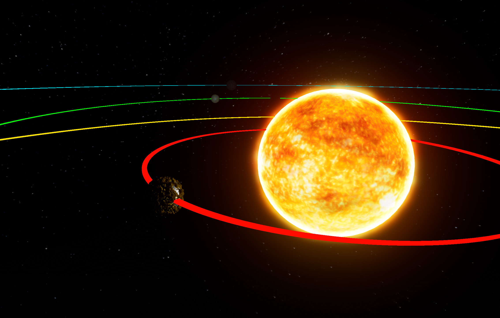 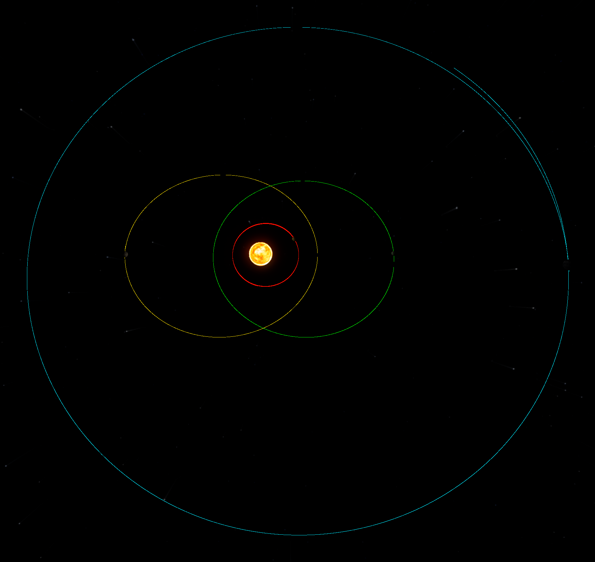

_Some random images_
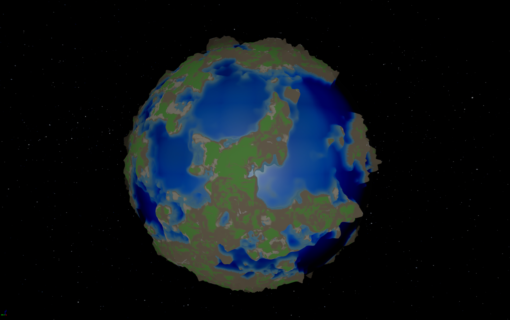 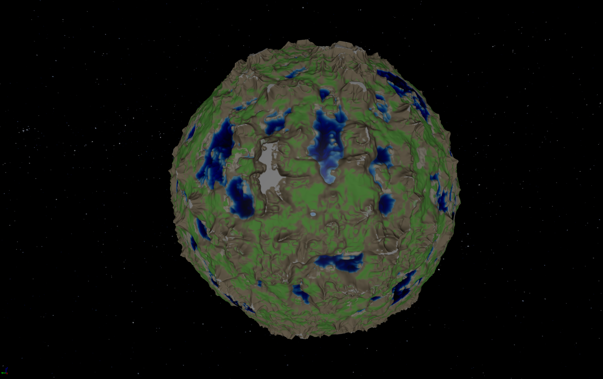 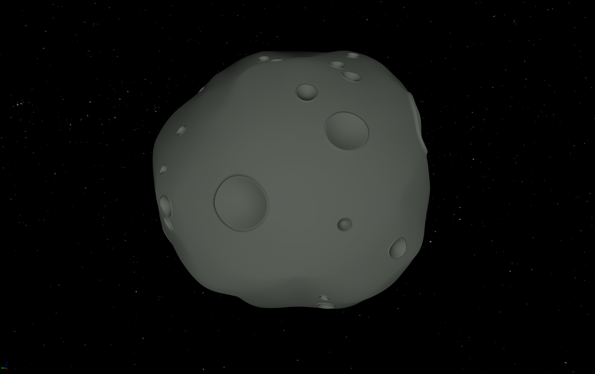 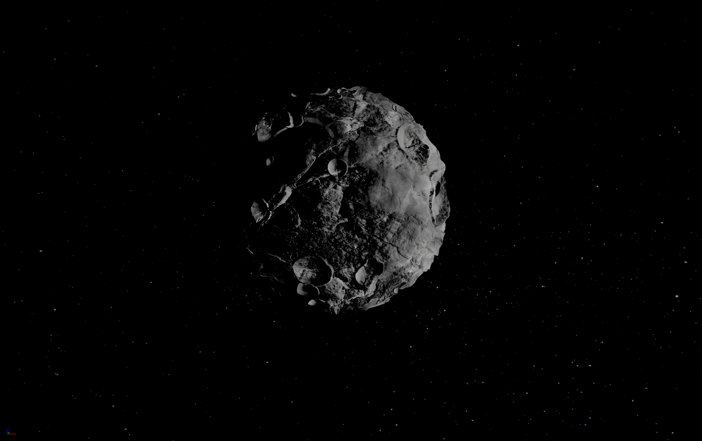 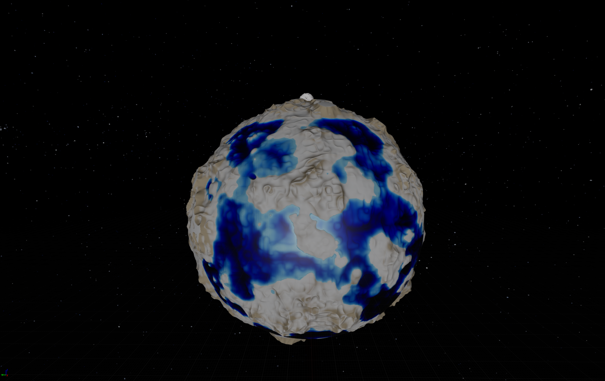
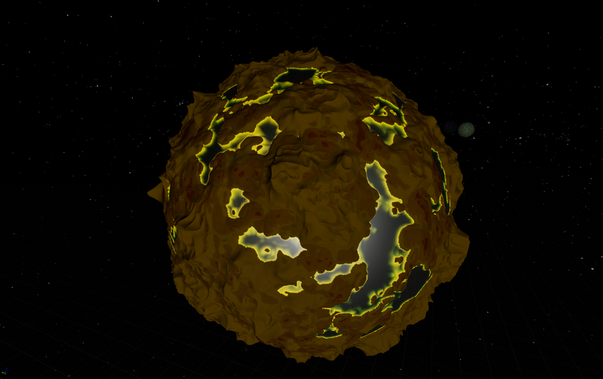 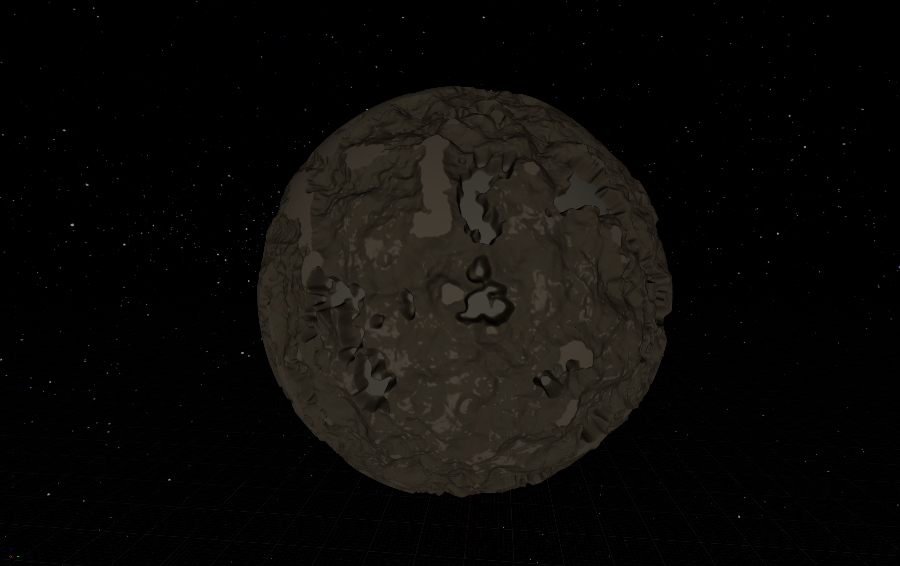 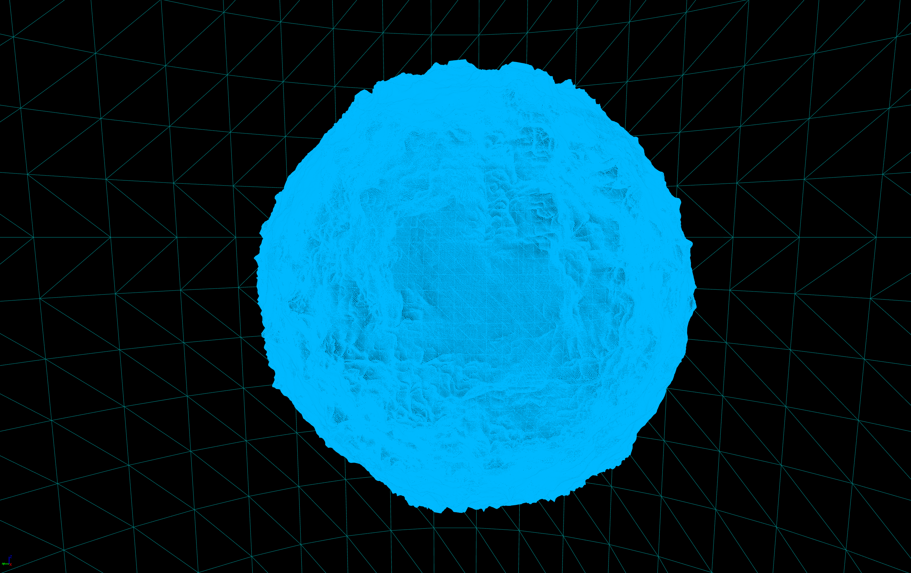
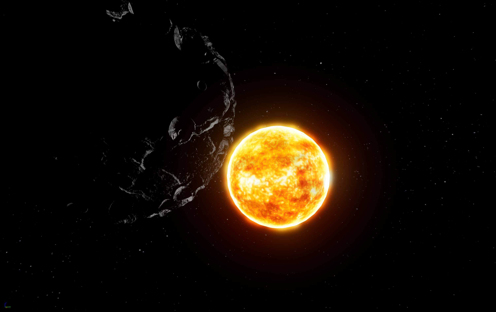
**Interesting Stuff**

- Screenshots -> [Screenshots](https://github.com/JoeMulc/Solar-System-U/tree/main/SolarSystemProject/Saved/Screenshots)
- Orbit calculations -> [OrbitingBody.Cpp](https://github.com/JoeMulc/Solar-System-U/blob/main/SolarSystemProject/Source/SolarSystemProject/OrbitingBody.cpp)
- Compute shaders -> [Sphere Shader](https://github.com/JoeMulc/Solar-System-U/blob/main/SolarSystemProject/Plugins/ShadeupPlugin/Shaders/ComputeModule/Private/SphereGenerationShader/SphereGenerationShader.usf), [Moon Shader](https://github.com/JoeMulc/Solar-System-U/blob/main/SolarSystemProject/Plugins/ShadeupPlugin/Shaders/ComputeModule/Private/CraterShader/CraterShader.usf), [Planet Shader](https://github.com/JoeMulc/Solar-System-U/blob/main/SolarSystemProject/Plugins/ShadeupPlugin/Shaders/ComputeModule/Private/PlanetGenerationShader/PlanetGenerationShader.usf), [Noise Shader](https://github.com/JoeMulc/Solar-System-U/blob/main/SolarSystemProject/Plugins/ShadeupPlugin/Shaders/ComputeModule/Private/NoiseShader/NoiseShader.usf)
- Pixel shaders -> The atmosphere shader is a post processing pixel shader built using unreals material system - a screenshot of HLSL code can be found [here](SolarSystemProject/Saved/Screenshots/WindowsEditor/Atmosphere_Shader_Code.png) and [here](SolarSystemProject/Saved/Screenshots/WindowsEditor/Atmosphere_Shader_Full.png).
- You can find generation parameters and shader dispatches here -> [Planet](https://github.com/JoeMulc/Solar-System-U/blob/main/SolarSystemProject/Source/SolarSystemProject/Planet.h), [Moon](https://github.com/JoeMulc/Solar-System-U/blob/main/SolarSystemProject/Source/SolarSystemProject/Moon.h)
