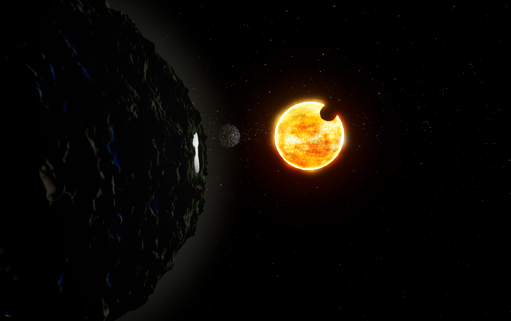
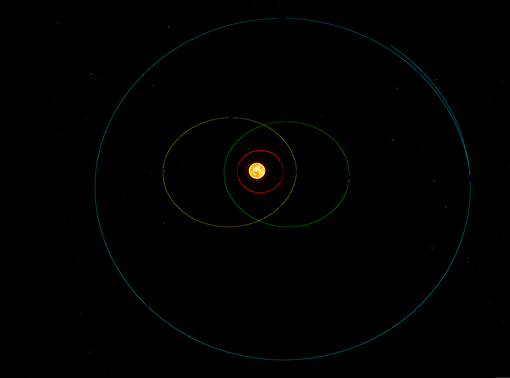
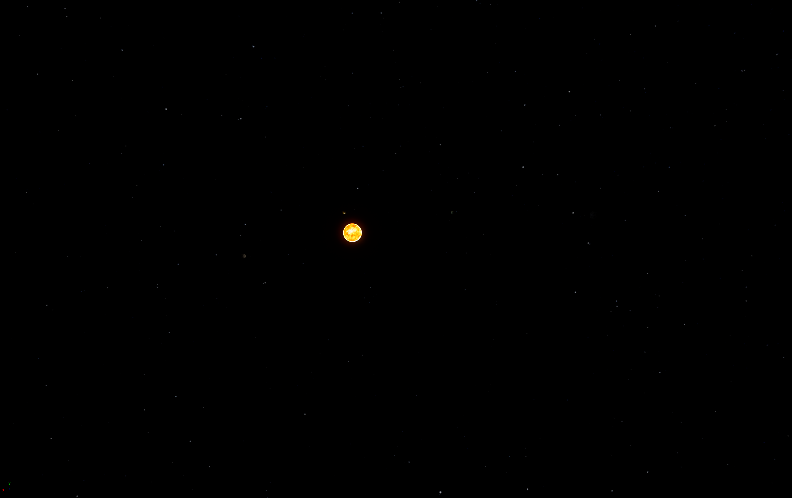

#  Procedural Solar System

A tool created for the generation and simulation of a solar system. Compute and pixel shaders generate the terrain, oceans and atmospheres of planets, moons and stars. Orbital calculations accurately simulate the forces being applied to all celestial bodies using Newtons law of universal gravitation. 

 

_Still working on atmospheres - image shows early stage_

**Interesting Stuff**

- Screenshots -> [Screenshots](https://github.com/JoeMulc/Solar-System-U/tree/main/SolarSystemProject/Saved/Screenshots)
- Orbit calculations -> [OrbitingBody.Cpp](https://github.com/JoeMulc/Solar-System-U/blob/main/SolarSystemProject/Source/SolarSystemProject/OrbitingBody.cpp)
- Compute shaders -> [Sphere Shader](https://github.com/JoeMulc/Solar-System-U/blob/main/SolarSystemProject/Plugins/ShadeupPlugin/Shaders/ComputeModule/Private/SphereGenerationShader/SphereGenerationShader.usf), [Moon Shader](https://github.com/JoeMulc/Solar-System-U/blob/main/SolarSystemProject/Plugins/ShadeupPlugin/Shaders/ComputeModule/Private/CraterShader/CraterShader.usf), [Planet Shader](https://github.com/JoeMulc/Solar-System-U/blob/main/SolarSystemProject/Plugins/ShadeupPlugin/Shaders/ComputeModule/Private/PlanetGenerationShader/PlanetGenerationShader.usf), [Noise Shader](https://github.com/JoeMulc/Solar-System-U/blob/main/SolarSystemProject/Plugins/ShadeupPlugin/Shaders/ComputeModule/Private/NoiseShader/NoiseShader.usf)
- Pixel shaders -> Atmosphere Shader, Ocean Shader
- You can find generation parameters and shader dispatches here -> [Planet](https://github.com/JoeMulc/Solar-System-U/blob/main/SolarSystemProject/Source/SolarSystemProject/Planet.h), [Moon](https://github.com/JoeMulc/Solar-System-U/blob/main/SolarSystemProject/Source/SolarSystemProject/Moon.h)
